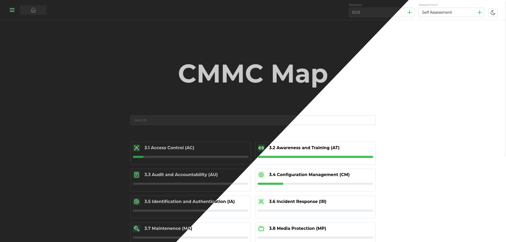
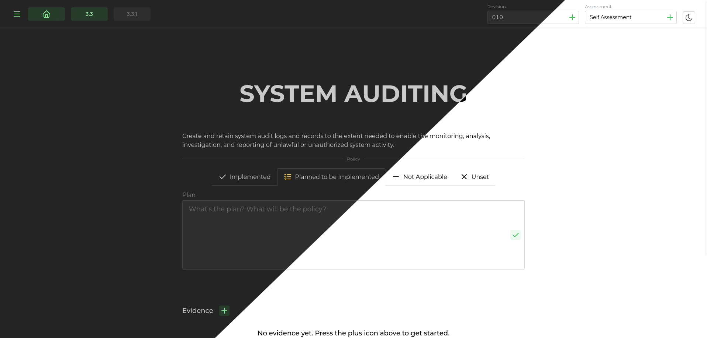

# CMMC-Map

This is a work in progress project to handle CMMC (Cybersecurity Maturation Model Certification) policy with a web app. Version 0.1.0 comming soon!

This project is licensed under the MIT License - see the [LICENSE.md](LICENSE.md) file for details

## Glamour Shots

## Running

Prebuilt docker containers are a work in progress, but for now containers can be built with the Dockerfile.prod scripts in backend and frontend each.

Or a single node stack can be run with

`docker compose -f docker-compose-prod.yaml up --build`

which will build the necessary containers and network them behind an nginx ingress handler with auto generated self signed certificates and a dedicated MariaDB container.

### Running without the docker compose

The only things strictly necessary are that the backend and frontend be served from the same origin and over https.
See the current [nginx config files](nginx/dev/localhost.conf) for which urls need to be forewarded to which service and with which headers.

## Configuration

The compose files simplify a lot, but if you'd like the specific environment variables for each container for more complex deployments, see [below](#backend-docker)

### Compose Files

| Environment Variable  | Description                                                                                            | Default/Required |
| --------------------- | ------------------------------------------------------------------------------------------------------ | ---------------- |
| PROJECT_URL           | The origin you are serving the whole application from. For example: https://example.com                | Required         |
| MARIADB_PASSWORD      | The password for the user account Django uses for accessing the database                               | Required         |
| MARIADB_ROOT_PASSWORD | The root password for acccessing the database outside of the application                               | Required         |
| DJANGO_SECRET_KEY     | The [secret key Django uses for signing things](https://docs.djangoproject.com/en/5.0/topics/signing/) | Required         |
| DJANGO_ROOT_PASSWORD  | The backend creates a root user by default to access the admin interface in development mode           | Required         |

### Backend Docker

| Environment Variable | Description                                                                                                                                                                                                                                                                                  | Default/Required |
| -------------------- | -------------------------------------------------------------------------------------------------------------------------------------------------------------------------------------------------------------------------------------------------------------------------------------------- | ---------------- |
| PROJECT_URL          | The origin you are serving the whole application from. For example: https://example.com                                                                                                                                                                                                      | Required         |
| DJANGO_ROOT_PASSWORD | The backend creates a root user by default to access the admin interface to create more users.                                                                                                                                                                                                 | Required         |
| DJANGO_SECRET_KEY    | The [secret key Django uses for signing things](https://docs.djangoproject.com/en/5.0/topics/signing/)                                                                                                                                                                                       | Required         |
| DJANGO_DEBUG         | Whether to run Django in debug mode or production                                                                                                                                                                                                                                            | False            |
| DJANGO_ALLOWED_HOSTS | Essentially a firewall of all sources Django will allow. For most cases all ('\*') is what you'll want.                                                                                                                                                                                      | Required         |
| DJANGO_DATABASE_URL  | This uses [dj-database-url](https://pypi.org/project/dj-database-url/) to tell Django how to connect to the database. In theory it could really be any database Django supports, but it's only tested with MariaDB and that's what the docker entrypoint tries to connect to when starting. | Required         |

### Frontend Docker

| Environment Variable | Description                                                                             | Default/Required |
| -------------------- | --------------------------------------------------------------------------------------- | ---------------- |
| PROJECT_URL          | The origin you are serving the whole application from. For example: https://example.com | Required         |

### Other notes on more complex environments

For the most part it's as simple as run the frontend and backend with a database from the same origin. Just do that with ssl and you're good. front and backend can scale horizontally to your hearts content even though that should never really be necessary.

## CMU Showcase Abstract

Managing cybersecurity policy to achieve Cybersecurity Maturity Model Certification (CMMC) 2.0 is increasingly critical for businesses. The conventional approach using text documents and spreadsheets, while functional, lacks intuitiveness and fails to efficiently link policies with the necessary “evidences” for compliance. Alternatively, enterprise-scale prebuilt solutions offer a comprehensive feature set but are prohibitively expensive for small business budgets. This project proposes the development of a web app designed to bridge this gap, offering an intuitive, solution for managing cybersecurity policy. By focusing on user-friendly interfaces for managers, IT personnel, and assessors, the app aims to streamline the process of achieving and maintaining CMMC 2.0 compliance. Key features will include streamlined evidence management, revision management, and a dashboard for compliance monitoring. The expected outcome is a significant simplification of the cybersecurity management process, enabling more effective compliance and enhancing the overall security posture of businesses.
